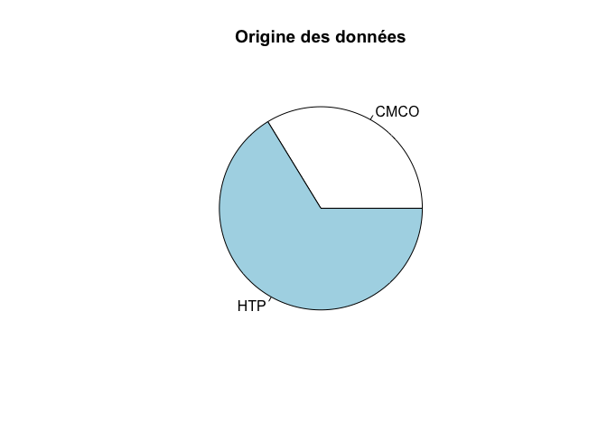
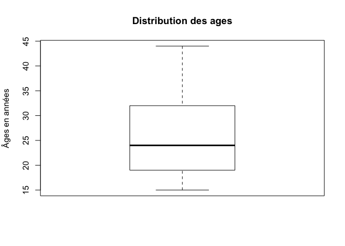
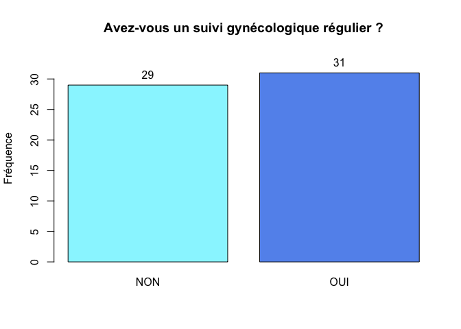
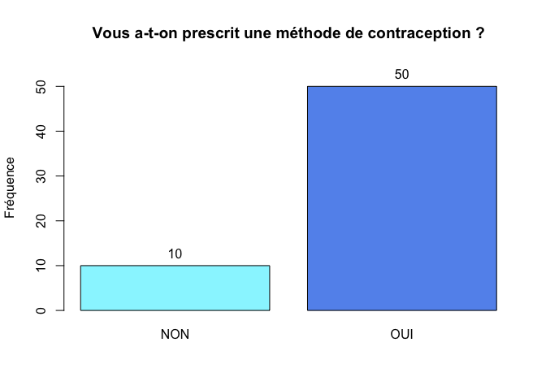
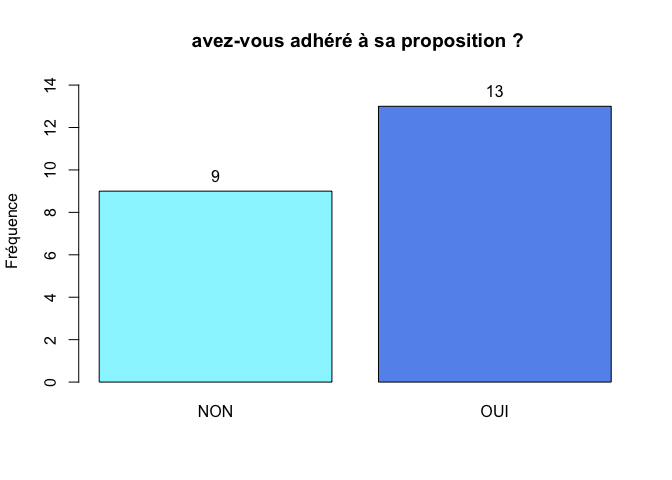
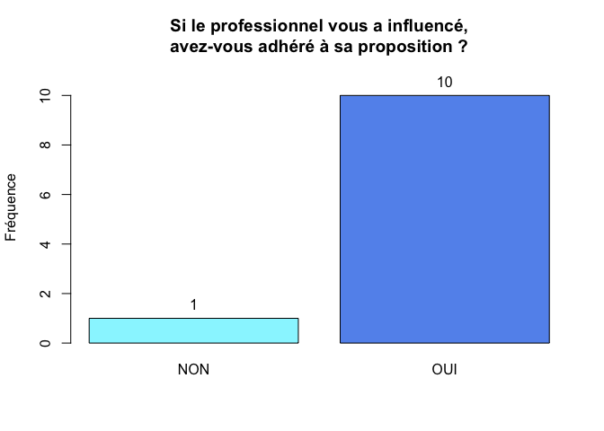

# Contraception après IVG
Noémie LERCH, JcB  
13/12/2014  
MAJ: 12/02/2015

Récupérer les données source
============================


Le fichier __../Data/QUESTIONNAIRE PATIENTE 12.02.15.csv__ contient __80__ enregistrements.

Analyse descriptive univariée
===================

Origine des données
-------------------

```

CMCO  HTP 
  27   53 
```

 

1. Age des participantes
------------------------


```
   Min. 1st Qu.  Median    Mean 3rd Qu.    Max.    NA's 
  15.00   19.25   24.00   25.88   32.00   44.00      22 
```

 

On souhaite représenter l'histogramme avec les classe d'age standard de la littérature:


```
age
[15,19] (19,24] (24,29] (29,34] (34,39] (39,44] (44,49] 
     15      15       8      11       7       2       0 
```

 


2. Niveau d’étude
---------------------


```
   AUTRE      bac Bac +2/3   Bac +5  CAP/BEP  COLLEGE   JAMAIS     NA's 
       1       20       13        2       14        7        1       22 
```

 

```
d$NIVEAU : 
         Frequency   %(NA+)   %(NA-)
AUTRE            1      1.2      1.7
bac             20     25.0     34.5
Bac +2/3        13     16.2     22.4
Bac +5           2      2.5      3.4
CAP/BEP         14     17.5     24.1
COLLEGE          7      8.8     12.1
JAMAIS           1      1.2      1.7
NA's            22     27.5      0.0
  Total         80    100.0    100.0
```

3. Êtes-vous en couple ?
---------------------


```
 NON  OUI NA's 
  17   43   20 
```

 

```
d$COUPLE : 
        Frequency   %(NA+)   %(NA-)
NON            17     21.2     28.3
OUI            43     53.8     71.7
NA's           20     25.0      0.0
  Total        80    100.0    100.0
```

4. Avez-vous déjà été enceinte avant cette grossesse ?
---------------------------------------------------


```
 NON  OUI NA's 
  25   35   20 
```

 

```
d$GROS_AVANT : 
        Frequency   %(NA+)   %(NA-)
NON            25     31.2     41.7
OUI            35     43.8     58.3
NA's           20     25.0      0.0
  Total        80    100.0    100.0
```

Si oui, combien de fois ?
-------------------------


```
NB_ACC NB_FCS NB_IVG NB_IMG 
    53      8     21      3 
```

```
   Min. 1st Qu.  Median    Mean 3rd Qu.    Max. 
  0.000   0.000   0.000   1.062   2.000   7.000 
```

 

```
nb.de.fois : 
        Frequency Percent Cum. percent
0              44    55.0         55.0
1              15    18.8         73.8
2               4     5.0         78.8
3              10    12.5         91.2
4               5     6.2         97.5
5               1     1.2         98.8
7               1     1.2        100.0
  Total        80   100.0        100.0
```

5. Combien d’enfants avez-vous ?
-----------------------------

 

```
d$NB_ENFANTS : 
        Frequency   %(NA+)   %(NA-)
0              34     42.5     56.7
1               9     11.2     15.0
2              10     12.5     16.7
3               4      5.0      6.7
4               3      3.8      5.0
NA's           20     25.0      0.0
  Total        80    100.0    100.0
```

6. Avez-vous un suivi gynécologique régulier
-------------------------------------------------
(au moins une consultation par an) ?

 

```
d$SUIVI : 
        Frequency   %(NA+)   %(NA-)
NON            29     36.2     48.3
OUI            31     38.8     51.7
NA's           20     25.0      0.0
  Total        80    100.0    100.0
```

7. Quelle méthode a été envisagée pour l’IVG ?
----------------------------------------------

 

```
d$IVG : 
        Frequency   %(NA+)   %(NA-)
CHIR           13     16.2     21.7
MED            47     58.8     78.3
NA's           20     25.0      0.0
  Total        80    100.0    100.0
```

8. Dans l’année précèdent votre grossesse, avez-vous changé de méthode de contraception ?
------------------------------------------------------------------------------------------

 

```
d$CHANGE : 
        Frequency   %(NA+)   %(NA-)
NON            45     56.2     76.3
OUI            14     17.5     23.7
NA's           21     26.2      0.0
  Total        80    100.0    100.0
```

9. Quelle(s) est/sont la ou les dernière(s) méthode(s) contraceptive(s) que vous avez utilisée avant cette grossesse ?
=======================================================================================================================


#### nombre de femmes utilisant chaque méthode contraceptive


```
     P     PM AUCUNE    IMP     PL     SC    AMC     SH 
    34     13     11      6      6      2      2      1 
```

 

```
      P    PM AUCUNE IMP PL   SC  AMC   SH
N 34.00 13.00  11.00   6  6 2.00 2.00 1.00
% 45.33 17.33  14.67   8  8 2.67 2.67 1.33
```
Note: une femme pouvant utiliser plusieurs méthodes contraceptives simultannément, le total peut dépasser la taille de l'échantillon.

#### nombre de méthode contraceptive utilisée par une femme


```
              1     2    3 NA's
Nb.de femmes 48  9.00 3.00   20
%            60 11.25 3.75   25
```


Depuis quand l’utilisez- vous ?
-------------------------------


```
3_mois 0,5_an 8_mois   1_an  2_ans  3_ans  4_ans  5_ans  6_ans >8_ans 
     1      7      1      5      7      5      5      2      1      1 
 9_ans 11_ans  12_an   NA's 
     2      1      1     41 
```

10. Cette méthode contraceptive vous convenait-t-elle ?
-------------------------------------------------------


```
 PAS_DU_TOUT PAS_VRAIMENT       PLUTOT  TOUT_A_FAIT         NA's 
          13           21           12            6           28 
```

 

```
d$TOLERANCE : 
             Frequency   %(NA+)   %(NA-)
PAS_DU_TOUT         13     16.2     25.0
PAS_VRAIMENT        21     26.2     40.4
PLUTOT              12     15.0     23.1
TOUT_A_FAIT          6      7.5     11.5
NA's                28     35.0      0.0
  Total             80    100.0    100.0
```

Si elle ne vous convenait pas, pourquoi ?
-----------------------------------------


11. Cette grossesse est survenue suite à
----------------------------------------
Plusieurs réponses possibles (col 31 à 37)

```r
cause <- d[, 31:37]
a <- lapply(cause, function(x){ifelse(is.na(x), "non", "oui")})
a <- as.data.frame(a)
x <- apply(a, 2, table)
b <- sapply(x, function(x){x[2]})
names(b) <- names(a)
par(mar = c(8, 4,3,2))
barplot(sort(b, decreasing = TRUE), main = "Cause de survenue de la grossesse", ylab = TRUE, las = 2)
```

 

12. Lors de votre demande d’IVG, avez-vous été informée sur les différents moyens de contraception ?
----------------------------------------------------------------------------------------------------

 

```
d$INFORMATION : 
        Frequency   %(NA+)   %(NA-)
NON             2      2.5      3.3
OUI            58     72.5     96.7
NA's           20     25.0      0.0
  Total        80    100.0    100.0
```


13. Vous a-t-on prescrit une méthode de contraception ?
-------------------------------------------------------

 

```
d$PRESCRIPTION : 
        Frequency   %(NA+)   %(NA-)
NON            10     12.5     16.7
OUI            50     62.5     83.3
NA's           20     25.0      0.0
  Total        80    100.0    100.0
```

Si oui, laquelle ?
------------------

 

```
d$PRES_OUI[d$PRESCRIPTION == "OUI"] : 
            Frequency   %(NA+)   %(NA-)
IMP                 8     11.4       16
P                  17     24.3       34
P  ST               1      1.4        2
P ST IMP AV         1      1.4        2
P ST IMP PM         1      1.4        2
PT                  1      1.4        2
ST                 20     28.6       40
ST IMP              1      1.4        2
<NA>               20     28.6        0
  Total            70    100.0      100
```

14. Avez-vous eu l’impression que le professionnel de santé a influencé votre choix ?

 

```
d$INFLUENCE : 
        Frequency   %(NA+)   %(NA-)
NON            46     57.5       78
OUI            13     16.2       22
NA's           21     26.2        0
  Total        80    100.0      100
```

Si oui, avez-vous adhéré à sa proposition ?
-------------------------------------------

Le "si oui" n'a pas ttoujours été respecté. Au moins une femme dit ne pas avoir été influencée mais n'accepte pas la proposition.

 

```
d$ACCEPTE : 
        Frequency   %(NA+)   %(NA-)
NON             9     11.2     40.9
OUI            13     16.2     59.1
NA's           58     72.5      0.0
  Total        80    100.0    100.0
```

 

```
d$ACCEPTE[d$INFLUENCE == "OUI"] : 
        Frequency   %(NA+)   %(NA-)
NON             1      2.9      9.1
OUI            10     29.4     90.9
NA's           23     67.6      0.0
  Total        34    100.0    100.0
```

15. Si vous n’adhérez pas à sa proposition, pourquoi ?
-----------------------------------------------------

ATTENTION: 

- non est écrit en minuscule (MAJUSCULE attendue)
- une réponse "pas envie" et "Accepte"  = NA

 

```
d$METHODE[d$ACCEPTE == "NON" & !is.na(d$ACCEPTE)] : 
             Frequency   %(NA+)   %(NA-)
AUTRE                3     33.3     50.0
BESOINS              0      0.0      0.0
MODE_VIE             2     22.2     33.3
PAS_DE_CONTR         0      0.0      0.0
PAS_ENVIE            1     11.1     16.7
NA's                 3     33.3      0.0
  Total              9    100.0    100.0
```

Le professionnel de santé :
--------------------------

ToDO...


16. À ce jour, quelle(s) méthode(s) de contraception avez-vous choisi?
----------------------------------------------------------------------

 

Evolution du choix de la méthode de contraception
-------------------------------------------------

 

```

	Fisher's Exact Test for Count Data

data:  a
p-value = 6.237e-11
alternative hypothesis: two.sided
```
Le choix d'une méthode de contraception est fortement modifié après la consultation (différence avant/après est statistiquement significative au test exact de Fisher (version améliorée du Khi2) p < 0.001 au seuil de risque alpha de 5%). La méthode qui convinct le plus de femmes est le Stérilet. Toutes les autres méthodes sont en diminution sauf les ilplants qui progressent très modestement.
