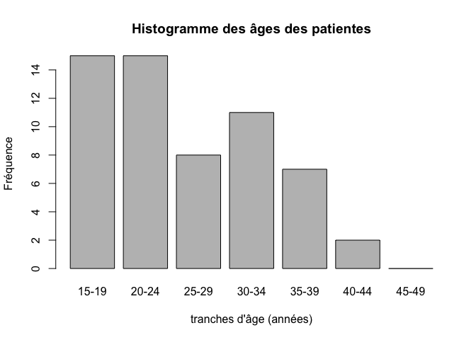
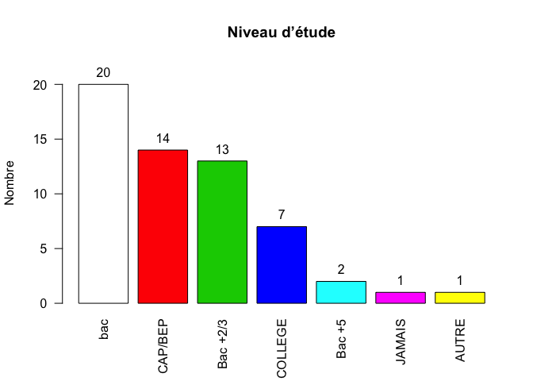
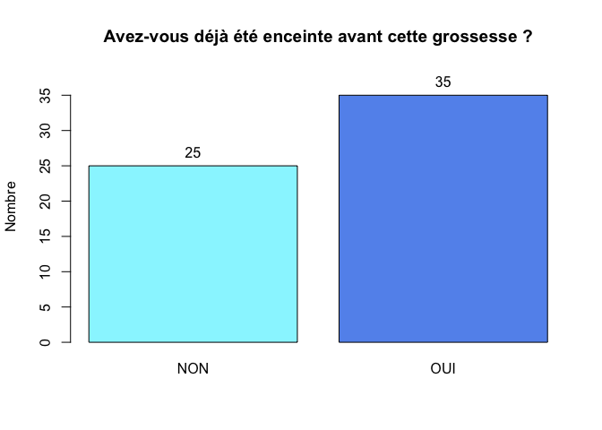
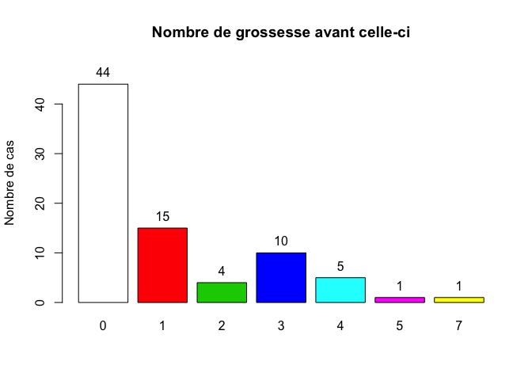
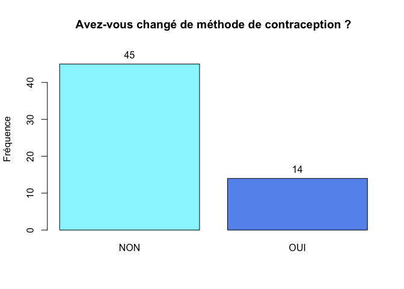
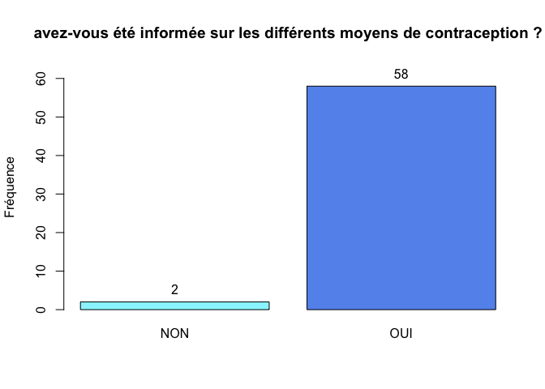
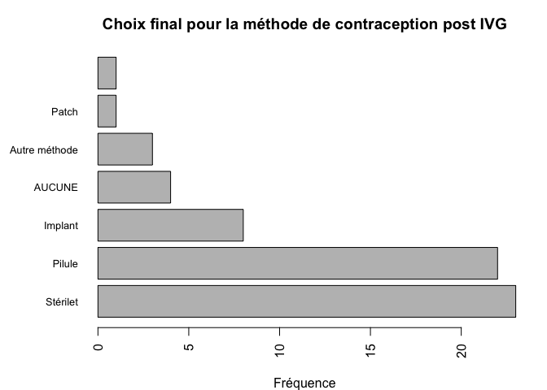

# Contraception après IVG
Noémie LERCH, JcB  
13/12/2014  


Récupérer les données source
============================


Le fichier __../Data/QUESTIONNAIRE PATIENTE 21.01.15.csv__ contient __79__ enregistrements.

Analyse descriptive univariée
===================

Origine des données
-------------------

```

CMCO  HTP 
  26   53 
```

1. Age des participantes
------------------------


```
   Min. 1st Qu.  Median    Mean 3rd Qu.    Max.    NA's 
  15.00   19.25   24.00   25.88   32.00   44.00      21 
```

 

 

On souhaite représenter l'histogramme avec les classe d'age standard de la littérature:


```
age
[15,19] (19,24] (24,29] (29,34] (34,39] (39,44] (44,49] 
     15      15       8      11       7       2       0 
```

 


2. Niveau d’étude
---------------------


```
   AUTRE      bac Bac +2/3   Bac +5  Bac + 5  CAP/BEP  COLLEGE   JAMAIS 
       1       20       13        1        1       14        7        1 
    NA's 
      21 
```

 

```
d$NIVEAU : 
         Frequency   %(NA+)   %(NA-)
AUTRE            1      1.3      1.7
bac             20     25.3     34.5
Bac +2/3        13     16.5     22.4
Bac +5           1      1.3      1.7
Bac + 5          1      1.3      1.7
CAP/BEP         14     17.7     24.1
COLLEGE          7      8.9     12.1
JAMAIS           1      1.3      1.7
NA's            21     26.6      0.0
  Total         79    100.0    100.0
```

3. Êtes-vous en couple ?
---------------------


```
 NON  OUI NA's 
  17   43   19 
```

 

```
d$COUPLE : 
        Frequency   %(NA+)   %(NA-)
NON            17     21.5     28.3
OUI            43     54.4     71.7
NA's           19     24.1      0.0
  Total        79    100.0    100.0
```

4. Avez-vous déjà été enceinte avant cette grossesse ?
---------------------------------------------------


```
 NON  OUI NA's 
  26   34   19 
```

 

```
d$GROS_AVANT : 
        Frequency   %(NA+)   %(NA-)
NON            26     32.9     43.3
OUI            34     43.0     56.7
NA's           19     24.1      0.0
  Total        79    100.0    100.0
```

Si oui, combien de fois ?
-------------------------


```
NB_ACC NB_FCS NB_IVG NB_IMG 
    53      8     18     66 
```

```
   Min. 1st Qu.  Median    Mean 3rd Qu.    Max. 
  0.000   1.000   1.000   1.835   3.000   8.000 
```

 

```
nb.de.fois : 
        Frequency Percent Cum. percent
0              19    24.1         24.1
1              25    31.6         55.7
2              13    16.5         72.2
3               6     7.6         79.7
4               9    11.4         91.1
5               4     5.1         96.2
6               2     2.5         98.7
8               1     1.3        100.0
  Total        79   100.0        100.0
```

5. Combien d’enfants avez-vous ?
-----------------------------

 

```
d$NB_ENFANTS : 
        Frequency   %(NA+)   %(NA-)
0              34     43.0     56.7
1               9     11.4     15.0
2              10     12.7     16.7
3               4      5.1      6.7
4               3      3.8      5.0
NA's           19     24.1      0.0
  Total        79    100.0    100.0
```

6. Avez-vous un suivi gynécologique régulier
-------------------------------------------------
(au moins une consultation par an) ?

 

```
d$SUIVI : 
        Frequency   %(NA+)   %(NA-)
NON            29     36.7     48.3
OUI            31     39.2     51.7
NA's           19     24.1      0.0
  Total        79    100.0    100.0
```

7. Quelle méthode a été envisagée pour l’IVG ?
----------------------------------------------

 

```
d$IVG : 
        Frequency   %(NA+)   %(NA-)
CHIR           13     16.5     21.7
MED            47     59.5     78.3
NA's           19     24.1      0.0
  Total        79    100.0    100.0
```

8. Dans l’année précèdent votre grossesse, avez-vous changé de méthode de contraception ?
------------------------------------------------------------------------------------------

 

```
d$CHANGE : 
        Frequency   %(NA+)   %(NA-)
NON            45     57.0     76.3
OUI            14     17.7     23.7
NA's           20     25.3      0.0
  Total        79    100.0    100.0
```

9. Quelle(s) est/sont la ou les dernière(s) méthode(s) contraceptive(s) que vous avez utilisée avant cette grossesse ?
=======================================================================================================================


#### nombre de femmes utilisant chaque méthode contraceptive


```
AUCUNE      P     SC     SH    IMP     PM     PL    AMC 
    10     34      2      1      6     13      6      2 
```

#### nombre de méthode contraceptive utilisée par une femme


```
               1 2 3 NA's
nb. de femmes 49 8 3   19
```


Depuis quand l’utilisez- vous ?
-------------------------------


```
0,5 ANS 0,5_ANS  11_ans  12_ANS    1_an    1_AN   2_ans   2 ANS   2_ANS 
      2       1       1       1       2       3       1       1       5 
  3_ans   3_ANS  3_MOIS   4 ANS   4_ANS   5_ANS   6_ANS  6_MOIS  >8_ANS 
      1       4       1       1       4       2       1       4       1 
 8_MOIS   9_ans    NA's 
      1       2      40 
```

10. Cette méthode contraceptive vous convenait-t-elle ?
-------------------------------------------------------


```
 PAS_DU_TOUT PAS_VRAIMENT       PLUTOT  TOUT_A_FAIT         NA's 
          13           21           12            6           27 
```

Si elle ne vous convenait pas, pourquoi ?
-----------------------------------------


11. Cette grossesse est survenue suite à
----------------------------------------


12. Lors de votre demande d’IVG, avez-vous été informée sur les différents moyens de contraception ?
----------------------------------------------------------------------------------------------------

 

```
d$INFORMATION : 
        Frequency   %(NA+)   %(NA-)
NON             2      2.5      3.3
OUI            58     73.4     96.7
NA's           19     24.1      0.0
  Total        79    100.0    100.0
```


13. Vous a-t-on prescrit une méthode de contraception ?
-------------------------------------------------------

 

```
d$PRESCRIPTION : 
        Frequency   %(NA+)   %(NA-)
NON            10     12.7     16.7
OUI            50     63.3     83.3
NA's           19     24.1      0.0
  Total        79    100.0    100.0
```

Si oui, laquelle ?
------------------

 

```
d$PRES_OUI[d$PRESCRIPTION == "OUI"] : 
            Frequency   %(NA+)   %(NA-)
IMP                 8     11.6       16
P                  17     24.6       34
P ST                1      1.4        2
P ST IMP AV         1      1.4        2
P ST IMP PM         1      1.4        2
PT                  1      1.4        2
ST                 19     27.5       38
ST                  1      1.4        2
ST IMP              1      1.4        2
NA's               19     27.5        0
  Total            69    100.0      100
```

14. Avez-vous eu l’impression que le professionnel de santé a influencé votre choix ?

 

```
d$INFLUENCE : 
        Frequency   %(NA+)   %(NA-)
NON            46     58.2       78
OUI            13     16.5       22
NA's           20     25.3        0
  Total        79    100.0      100
```

Si oui, avez-vous adhéré à sa proposition ?
-------------------------------------------

Le "si oui" n'a pas ttoujours été respecté. Au moins une femme dit ne pas avoir été influencée mais n'accepte pas la proposition.

 

```
d$ACCEPTE : 
        Frequency   %(NA+)   %(NA-)
non             1      1.3      4.5
NON             8     10.1     36.4
OUI            13     16.5     59.1
NA's           57     72.2      0.0
  Total        79    100.0    100.0
```

 

```
d$ACCEPTE[d$INFLUENCE == "OUI"] : 
        Frequency   %(NA+)   %(NA-)
non             0      0.0      0.0
NON             1      3.0      9.1
OUI            10     30.3     90.9
NA's           22     66.7      0.0
  Total        33    100.0    100.0
```

15. Si vous n’adhérez pas à sa proposition, pourquoi ?
-----------------------------------------------------

ATTENTION: 

- non est écrit en minuscule (MAJUSCULE attendue)
- une réponse "pas envie" et "Accepte"  = NA

 

```
d$METHODE[d$ACCEPTE == "NON" & !is.na(d$ACCEPTE)] : 
             Frequency   %(NA+)   %(NA-)
AUTRE                3     33.3     50.0
BESOINS              0      0.0      0.0
MODE_VIE             2     22.2     33.3
PAS_DE_CONTR         0      0.0      0.0
PAS_ENVIE            1     11.1     16.7
NA's                 3     33.3      0.0
  Total              9    100.0    100.0
```

Le professionnel de santé :
--------------------------

ToDO...


16. À ce jour, quelle(s) méthode(s) de contraception avez-vous choisi?
----------------------------------------------------------------------


```
AUCUNE      P     SC     SH    IMP     PT     AV     PM     SP     RT 
     1      2      2      1      1      1      1      1      1      1 
    AB     CT   <NA>   <NA>   <NA>   <NA>   <NA>   <NA>   <NA>   <NA> 
     1      1      1      1      1      1      1      1      1      1 
  <NA>   <NA>   <NA>   <NA>   <NA>   <NA>   <NA>   <NA>   <NA>   <NA> 
     1      1      1      1      1      1      1      1      1      1 
  <NA>   <NA>   <NA>   <NA>   <NA>   <NA>   <NA>   <NA>   <NA>   <NA> 
     1      1      2      1      1      1      2      1      1      1 
  <NA>   <NA>   <NA>   <NA>   <NA>   <NA>   <NA>   <NA>   <NA>   <NA> 
     1      1      1      1      1      1      1      1      1      1 
  <NA>   <NA>   <NA>   <NA>   <NA>   <NA>   <NA> 
     1      1      1      1      1      1      2 
```

 

